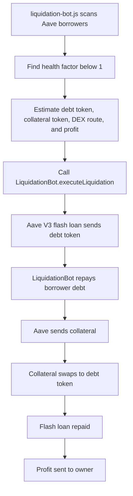

# Polygon Mainnet Guide

The supported mainnet path is the Aave V3 liquidation bot:

- Contract: `contracts/LiquidationBot.sol`
- Deploy script: `scripts/deploy-liquidation.js`
- Bot: `bot/liquidation-bot.js`
- Network: Polygon mainnet, chain id `137`

## Required Environment

Root `.env`:

```env
POLYGON_RPC_URL=https://polygon-rpc.com/
PRIVATE_KEY=your_wallet_private_key
ETHERSCAN_API_KEY=your_etherscan_v2_api_key_optional
```

Bot `.env`:

```env
POLYGON_RPC_URL=https://polygon-rpc.com/
PRIVATE_KEY=your_wallet_private_key
LIQUIDATION_BOT_ADDRESS=your_deployed_liquidation_bot_address
GRAPH_API_KEY=your_graph_api_key
```

## Commands

Compile:

```bash
npx hardhat compile
```

Test:

```bash
npx hardhat test
```

Deploy to Polygon:

```bash
npm run deploy:polygon
```

Run the bot:

```bash
npm run bot:liquidation
```

Verify on PolygonScan:

```bash
npx hardhat verify --network polygon <LIQUIDATION_BOT_ADDRESS>
```

## Liquidation Flow



## Notes

- Mumbai is not used.
- `npm run deploy:polygon` deploys `LiquidationBot`, not a legacy flash-loan contract.
- The bot checks that the configured wallet owns the deployed contract before it starts.
