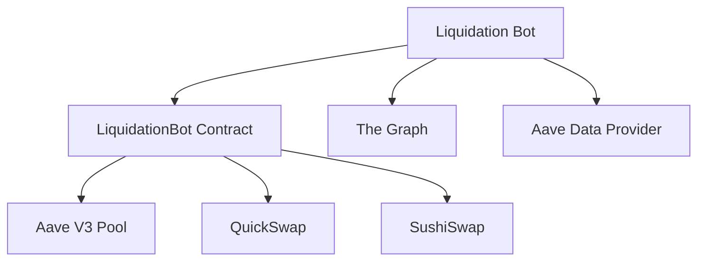

[](https://opensource.org/licenses/MIT)
[](https://soliditylang.org/)
[](https://hardhat.org/)
[](https://polygon.technology/)

# Flash Loan Liquidation Bot for Polygon

This project is a refactored version of the original Flash Loan project, specifically designed for Aave V3 liquidation execution on Polygon. It includes smart contracts optimized for Polygon's architecture, a monitoring bot, and comprehensive testing suites.

## Table of Contents

1. [Overview](#overview)
2. [Architecture](#architecture)
3. [Smart Contracts](#smart-contracts)
4. [Bot Implementation](#bot-implementation)
5. [Installation](#installation)
6. [Testing](#testing)
7. [Deployment](#deployment)
8. [Configuration](#configuration)
9. [Usage](#usage)
10. [Risk Management](#risk-management)
11. [Troubleshooting](#troubleshooting)
12. [Contributing](#contributing)
13. [License](#license)
14. [Disclaimer](#disclaimer)

## Overview

This project is focused on Aave V3 liquidation execution on Polygon. It uses Aave flash loans to repay unhealthy borrower debt, receives collateral, swaps that collateral back to the debt token, repays the flash loan, and sends remaining profit to the owner wallet.

Key features:
- Aave V3 flash-loan liquidation support
- Chainlink oracle integration
- Risk management with circuit breakers
- Gas optimization for Polygon
- Comprehensive testing suite

## Architecture



### Core Components

1. **FlashLoanPolygon.sol**: Main contract implementing flash loan functionality
2. **PriceOraclePolygon.sol**: Price oracle for multi-DEX price feeds
3. **MockOracle.sol**: Mock Chainlink oracle for testing
4. **Liquidation Bot**: JavaScript implementation for Aave borrower monitoring and liquidation execution
5. **Deployment Scripts**: Scripts for Polygon mainnet and supported testnet configuration

## Smart Contracts

### FlashLoanPolygon.sol

The main contract that implements flash loan functionality optimized for Polygon:

- **Gas Optimized**: Uses unchecked blocks and minimal storage writes
- **Multi-DEX Support**: Can execute arbitrage across multiple DEXs
- **Risk Management**: Implements circuit breakers, daily volume limits, and asset risk configurations
- **Oracle Integration**: Uses Chainlink oracles for price validation
- **Security Features**: Reentrancy protection, 2-step ownership, and pausable functionality

### PriceOraclePolygon.sol

Price oracle contract that provides pricing information from multiple DEXs:

- **Multi-DEX Support**: Supports QuickSwap, SushiSwap, and other Polygon DEXs
- **TWAP Calculations**: Time-weighted average price calculations
- **Chainlink Integration**: Integration with Chainlink price feeds
- **Arbitrage Detection**: Identifies price discrepancies between DEXs

### MockOracle.sol

Mock Chainlink oracle for local and testnet simulations.

## Bot Implementation

The active bot is implemented in JavaScript:

- **Real-time Monitoring**: Monitors new blocks and Aave borrower health factors
- **Collateral Filtering**: Checks borrower collateral balances and collateral-enabled status
- **Profit Estimation**: Estimates QuickSwap and SushiSwap liquidation routes
- **Auto-execution**: Executes profitable liquidations through the deployed `LiquidationBot`
- **Risk Management**: Requires the configured wallet to own the deployed contract

## Installation

### Prerequisites

- Node.js >= 16.0.0
- npm >= 7.0.0
- Hardhat >= 2.26.3

### Setup

```bash
# Clone the repository
git clone <repository-url>
cd FlashLoan

# Install dependencies
npm install

# Navigate to bot directory and install bot dependencies
cd bot
npm install
cd ..
```

## Testing

### Unit Tests

```bash
# Run unit tests
npx hardhat test

# Run specific test file
npx hardhat test test/FlashLoanPolygon.test.js
```

### Fork Tests

```bash
# Run fork tests (requires Polygon mainnet fork)
npx hardhat test test/FlashLoanPolygon.fork.test.js
```

### Coverage and Gas Reports

```bash
# Run coverage report
npx hardhat coverage

# Run gas report
REPORT_GAS=true npx hardhat test
```

## Deployment

### Polygon Mainnet

```bash
# Deploy to Polygon mainnet
npx hardhat run scripts/deploy-polygon.js --network polygon
```

### Verification

```bash
# Verify contracts on PolygonScan
npx hardhat verify --network polygon <contract-address> <constructor-args>
```

## Configuration

### Environment Variables

Create a `.env` file in the bot directory with the following variables:

```env
# Polygon RPC URL
POLYGON_RPC_URL=https://polygon-rpc.com/

# Wallet private key (keep this secret!)
PRIVATE_KEY=your_private_key_here

# Contract address (deployed LiquidationBot)
LIQUIDATION_BOT_ADDRESS=your_liquidation_bot_contract_address_here

# The Graph API key for borrower discovery
GRAPH_API_KEY=your_graph_api_key_here

# Explorer API keys for verification
POLYGONSCAN_API_KEY=your_polygonscan_api_key_here
```

### Network Configuration

The project is configured to work with the following networks:

1. **Polygon Mainnet**
   - Chain ID: 137
   - RPC URL: https://polygon-rpc.com/

2. **Polygon Amoy Testnet**
   - Chain ID: 80002
   - RPC URL: https://rpc-amoy.polygon.technology/

## Usage

### 1. Compile Contracts

```bash
npx hardhat compile
```

### 2. Deploy Contracts

```bash
# For Polygon mainnet
npx hardhat run scripts/deploy-liquidation.js --network polygon
```

### 3. Run the Bot

```bash
# Navigate to bot directory
cd bot

# Run the bot
npm start
```

### 4. Monitor Logs

The bot will output logs showing:
- Current gas prices
- Block processing
- Arbitrage opportunities found
- Transaction execution results

## Risk Management

### Slippage Protection

The system implements slippage protection with configurable limits to prevent losses from price movements during trade execution.

### Circuit Breakers

Circuit breakers automatically pause the system when abnormal conditions are detected:
- Daily volume limits
- Price deviation thresholds
- Recursion depth limits

### Daily Limits

- **Daily Volume Limit**: 1,000,000 tokens
- **Maximum Recursion Depth**: 3 levels
- **Asset-Specific Risk Configurations**: Per-token limits and risk scores

## Troubleshooting

### Common Issues

1. **Compilation Errors**
   ```bash
   # Clean and recompile
   npx hardhat clean
   npx hardhat compile
   ```

2. **Network Connection Issues**
   - Verify RPC URLs in configuration
   - Check network connectivity
   - Ensure sufficient funds for gas

3. **Bot Execution Issues**
   - Check environment variables
   - Verify contract addresses
   - Ensure private key has sufficient funds

### Debugging

```bash
# Enable verbose logging
DEBUG=flashloan:* npm start
```

## Contributing

1. Fork the repository
2. Create a feature branch (`git checkout -b feature/amazing-feature`)
3. Commit your changes (`git commit -m 'Add amazing feature'`)
4. Push to the branch (`git push origin feature/amazing-feature`)
5. Open a Pull Request

### Code Standards

- **Solidity**: Follow [Solidity Style Guide](https://docs.soliditylang.org/en/latest/style-guide.html)
- **JavaScript/TypeScript**: ESLint configuration provided
- **Testing**: Minimum 95% code coverage required
- **Documentation**: All functions must include NatSpec comments

## License

This project is licensed under the MIT License - see the [LICENSE](LICENSE) file for details.

## Disclaimer

**IMPORTANT**: This software is provided "as is" without warranty. Flash loan arbitrage involves significant financial risks including:

- **Smart Contract Risk**: Potential bugs or exploits
- **Market Risk**: Price volatility and slippage
- **Gas Risk**: Network congestion and failed transactions
- **Regulatory Risk**: Changing legal landscape

**Always perform thorough testing and risk assessment before deploying to mainnet with real funds.**

---

<div align="center">

**Built with ❤️ for the DeFi Community**

*Empowering the next generation of decentralized finance on Polygon*

</div>
